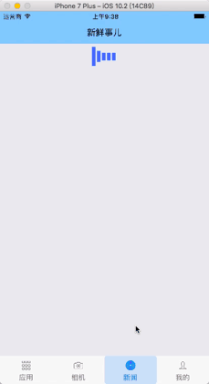

commonProject
=
    基于react-native v0.53版本创建的通用项目，目的在于累积组件，拓展业务新能力。
    commonProject base on react-native v0.53
# 目的与意义
你可以基于本项目创建一个沙盒项目，用于研究新功能来扩展现有业务。
-
当然你也可以基于本项目来进行开发，要是能告诉我那就更好了。
-
You can create a sandbox project based on this project to research new features to extend existing business.
-
Of course, you can also develop based on this project. It would be better if you could tell me.
-

# 目前包含的组件：

| 组件名称  | 用处 | 入口  |
|-------|-------|-------:|
| [动画组件](#1动画组件react-native-animatable )  | 可以给组件增加动画 | 尚未写入口 |
| [网络组件](#2网络组件httputilsjs) | Promise统一封装网络请求 | 登录请求时使用   |
| [Loading动画组件](#3loading动画组件spinnerjs)  | 请求网络或跳转时的加载动画 | 登录请求时使用     |
| [带图片列表](#4card-image-列表组件展示newsjs)  | 展示带图片、文字或者小标题的列表 | 主页新闻列表     |
| [网络检测](#5netinfo-检测用户网络状态loginpagejs)  | 实时获取用户网络，提醒注意流量等 | 登录页面或网络状态更改时     |
| [多图选择器](#6imagepicker-多图选择器loginpagejs)  | 良好体验的图片选择器 | 登录后主页进入     |
| [热更新](#7code-push-热更新codepushscreenjs)  | 更新无需重新下载，更快速迭代版本 | 登录页左下角进入     |
| [指纹识别](#8touch-id-指纹识别touchidviewjs)  | 指纹识别 & iOS 高版本有 FaceId | 登录后主页选择指纹识别模块     |
| [横竖屏切换](#9orientation-横竖屏切换mainpagejs)  | 横竖屏切换工具 | 登录后主页选择横竖屏切换模块     |

## 1.动画组件：react-native-animatable 
    文件位置：commonPage/Animatable/Animatable.js

## 2.网络组件：HttpUtils.js
    文件位置：Fetch/HttpUtils.js
    作用：通过在Components/commonLinks.js中设置接口api地址，在同目录operationActions.js中调用Fetch/HttpUtils中进行请求，可选get/post。

## 3.Loading动画组件:/spinner.js
    文件位置：commonPage/Spinner/spinner.js
    作用：用于网络请求中时，展示loading动画，增强交互。

## 4.Card Image 列表组件展示:News.js
    文件位置：News/news.js
    作用：用于展示带图片，头像的信息列表。

## 5.NetInfo 检测用户网络状态:LoginPage.js
    文件位置：Login/loginPage.js
    作用：检测用户的网络变化，作出相应提示。

## 6.ImagePicker 多图选择器:LoginPage.js
    使用组件：react-native-syan-image-picker
    文件位置：Components/ImagePicker/imagePickerComponents.js
    作用：选择多张图片，可进行编辑（仅选单张可以），浏览。

## 7.Code-Push 热更新:CodePushScreen.js
    使用组件：react-native-code-push
    文件位置：Components/CodePush/CodePushScreen.js
    作用：iOS，安卓热更新部署。

## 8.Touch-id 指纹识别:TouchIdView.js
    使用组件：react-native-touch-id
    文件位置：Components/TouchId/TouchIdView.js
    作用：安卓，iOS指纹识别，iOS 高版本有 Face Id。

## 9.Orientation 横竖屏切换:MainPage.js
    使用组件：react-native-orientation
    文件位置：Components/MainPage.js
    作用：切换屏幕方向。

# Currently included components:

| Component Name | Use | Entrance |
|-------|-------|-------:|
| [Animation component] (#1 animation component react-native-animatable ) | Can add animation to component | Not yet written to |
| [Network Components] (#2 Network Components httputilsjs) | Promise Unified Encapsulation Network Request | Login Request |
[Loading animation component] (#3loading animation component spinnerjs) | Loading animation when requesting network or jump | Use when logging in request |
[With picture list] (#4card-image-list component display newsjs) | Show list with pictures, text or subtitles | Home News List |
[Network Detection] (#5netinfo-Detect User Network Status loginpagejs) | Get user network in real time, remind you of traffic, etc. | When login page or network status changes |
[Multiple Image Selector](#6imagepicker-Multiple Image Selector loginpagejs) | Good Experience Image Selector | Login Homepage Entry |

## 1.Animation component: react-native-animatable
    File location: commonPage/Animatable/Animatable.js

## 2. Network component: HttpUtils.js
    File location: Fetch/HttpUtils.js
    Role: By setting the interface api address in Components/commonLinks.js, call Fetch/HttpUtils in the same directory operationActions.js to make the request, optional get/post.

## 3.Loading animation component: /spinner.js
    File location: commonPage/Spinner/spinner.js
    Role: When used in a network request, display loading animation and enhance interaction.

## 4.Card Image List component display: News.js
    File location: News/news.js
    Role: used to display a list of information with pictures, avatars.

## 5.NetInfo Detecting User Network Status: LoginPage.js
    File location: Login/loginPage.js
    Function: Detect the user's network changes and make corresponding prompts.

## 6.ImagePicker Multi-Picture Selector: LoginPage.js
    Use component: react-native-syan-image-picker
    File location: Components/ImagePicker/imagePickerComponents.js
    Function: Select multiple pictures, you can edit them (only one can be selected), browse.
    
## 7.Code-Push Hot Update: CodePushScreen.js
    Use component: react-native-code-push
    File location: Components/CodePush/CodePushScreen.js
    Role: iOS, Android hot update deployment.

## 8.Touch-id Fingerprint Recognition: TouchIdView.js
    Use component: react-native-touch-id
    File location: Components/TouchId/TouchIdView.js
    Role: Android, iOS fingerprint recognition, iOS high version has Face Id.

## 9.Orientation Horizontal and vertical screen switching: MainPage.js
    Use components: react-native-orientation
    File location: Components/MainPage.js
    Function: Switch the screen orientation.
